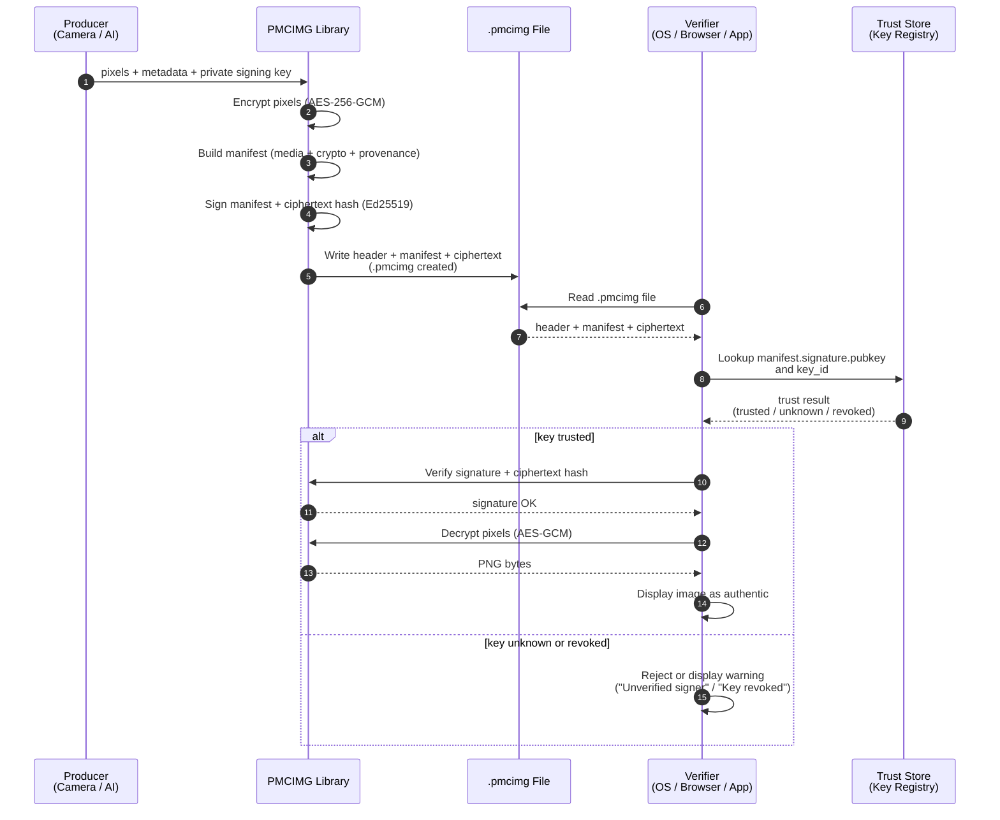

# Why we created PMCIMG

## 1. Why PMCIMG Matters (Especially for AI Images)

**AI** systems can generate photorealistic images that are impossible to distinguish from real photos. These images can be copied, modified, screenshotted, or re-uploaded anywhere, and all **provenance** is instantly lost.

Existing authenticity standards like **C2PA** help, but they rely on **metadata** that can be stripped or ignored. Nothing in today’s image formats enforces provenance.

**PMCIMG** changes that by making provenance mandatory for decoding:

- Pixels are encrypted
- The manifest contains the key
- Removing or altering the manifest makes the image unreadable
- Any pixel-level modification breaks verification
- Screenshots or recompressions cannot pass as originals

This provides the missing enforcement layer needed for a world where AI-generated media is ubiquitous.
## 2. The Core Problem
Today, anyone can:
- modify an image,
- screenshot it,
- remove metadata,
- re-upload it,
- and there is no reliable way to know whether the media is authentic.

The internet has no built-in mechanism to enforce:
- where a media object came from,
- whether it was altered,
- or whether its provenance was stripped.

As a result:
<pre><b>Authenticity is optional, fragile, and easy to remove.</b></pre>

## 3. How C2PA Partially Solves the Problem

C2PA defines a standardized way to attach **cryptographically signed
provenance manifests** to media.

A C2PA manifest may be:
- **Embedded** inside the image file (e.g. JPEG/PNG containers), or
- **Stored externally** and linked via a reference or recovered through
  a **soft binding** mechanism (e.g. watermark or fingerprint).

C2PA supports:
- **Hard binding**: cryptographic hashes over pixel data or regions,
  enabling tamper detection if the manifest is available.
- **Soft binding**: non-cryptographic identifiers that help recover
  a manifest if metadata is stripped or the image is re-encoded.

This allows C2PA to:
- Declare who produced or edited the media
- Provide a signed record of capture, edits, or AI generation
- Detect tampering *when the manifest is present and verifiable*

### Limitations

#### ❌ Provenance is optional at render time and not inforced

If embedded metadata is removed, or if external manifests cannot
be recovered:

- The image still renders normally
- Provenance may disappear silently
- No failure is observable at the pixel level

C2PA relies on user agents or platforms to surface
“credential missing” states, but cannot enforce them.

#### ❌ External verification may depend on infrastructure availability

When using external manifests or soft binding:

- Verification may require access to a remote manifest repository
- Offline or long-term verification can fail if the repository is unavailable
- Trust depends on correct repository resolution and integrity

This introduces operational and availability dependencies outside
the image file itself.

#### ❌ Pixel data is not structurally protected

C2PA signs the **manifest**, not the image container itself.

An attacker can:
- Modify pixel data
- Strip or invalidate the manifest
- Redistribute a visually plausible image with no provenance attached

While tampering can be detected *if* the manifest is present,
C2PA does not prevent pixels from being rendered without provenance.

## 4. How PMCIMG Fully Solves the Problem

**PMCIMG** introduces a secure container where:

- Pixels are encrypted
- Manifest contains the key
- Manifest is required to decrypt
- Signature binds manifest ↔ ciphertext

If the manifest is removed or altered:

- pixels cannot be decrypted
- signature verification fails
- authenticity breaks loudly, not silently

This solves both of **C2PA**’s limitations:

**✔ Manifest cannot be stripped**

Removing the manifest makes the image unreadable.

**✔ Pixel integrity is enforced**

Any change to the encrypted pixel block breaks the **AES-GCM** authentication tag.

**✔ Provenance becomes mandatory**

The image format forces platforms and tools to preserve authenticity.

**PMCIMG** does not replace **C2PA** — it makes **C2PA** enforceable.

### 4.1 Where the Signature Comes From (Cameras & AI Platforms)

A secure format only works if the source of the image produces a signature.
This means:
- Camera phones, and hardware modules embed a device or manufacturer key and sign the manifest when capturing real photos.
- AI image generators (ChatGPT, Midjourney, Stable Diffusion servers, etc.) must sign the manifest before exporting the image.

Just like C2PA, PMCIMG does not invent authenticity —
the origin device or platform must sign.

The key difference:
With PMCIMG, this manifest is **mandatory for decoding the pixels**.

So:

- If a real camera signs → pixels can be decrypted, provenance preserved
- If an AI generator signs → image proves it came from that model
- If someone strips or alters the manifest → image becomes unreadable

This makes authenticity enforceable at the file-format level,
not optional metadata that platforms can ignore.

<pre><b>Real cameras sign. AI generators sign. PMCIMG enforces. </b></pre>

### 4.2. How PMCIMG Works in Practice (Real-World Adoption)

For PMCIMG to work at scale, the ecosystem must follow a simple rule:
- Whoever creates the pixels must sign the container.
- Whoever displays the pixels must verify the container.

This divides adoption into two sides:

#### A. Producers (devices & platforms) must sign using their own keys

This includes:
- Camera phones (Apple, Samsung, Google Pixel)
- DSLRs / Mirrorless cameras (Canon, Sony, Nikon)
- AI image generators (ChatGPT, Midjourney, Adobe Firefly, etc.)
- Image-producing apps (Instagram camera, Snapchat, TikTok, Canva, etc.)

When exporting an image, they do:
- Encode pixels
- Encrypt pixels
- Create manifest
- Sign manifest with device/platform key
- Pack everything into a .pmcimg file

This is a single API call for developers:

```js
pmcimg::encode(pixels, signing_key)
```

#### B. Platforms & tools must verify before displaying

Anyone who shows an image must:

- Extract the manifest
- Verify the signature
- Decrypt pixels
- Display the result

This includes:
- Browsers (Chrome, Safari, Firefox)
- Social platforms (Twitter/X, TikTok, Reddit…)
- Messaging apps (iMessage, WhatsApp, Telegram)
- Image editors (Photoshop, GIMP, Lightroom)
- Operating systems (iOS, Android, Windows, macOS)

If verification fails:
- Image refuses to load
- Or is shown with a visible warning (“Authenticity broken”)

This keeps provenance intact end-to-end.

#### C. What Happens With Screenshots or Edits?

- A screenshot produces new pixels, so the screenshotting device signs a new PMCIMG file
- Editing software can re-sign after editing (like C2PA workflows), OR preserve the chain of edits

If someone removes the manifest →
Image becomes unreadable.

If someone modifies the ciphertext →
AES-GCM authentication fails.

This prevents “silent stripping” — the core problem with C2PA today.

Here is diagram explaining the lifecycle of `pmcimg` file, we will go into detail after this to see how an adoption plan would look like:



#### D. How Adoption Would Likely Roll Out

**Phase 1 – Open-source SDKs (this project)**
- Rust library
- WASM for browsers
- C/C++ bindings
- npm & Python wrappers

**Phase 2 – Browser support**

Browsers supports new image format:
```html

```

This unlocks every web platform instantly.

**Phase 3 – AI platform adoption**

AI generators add PMCIMG export (very easy because they already generate pixel buffers + manifest JSON).

**Phase 4 – Smartphone integration**

Cameras adopt signing keys (some already exist internally for DRM, Widevine, Secure Enclave).

**Phase 5 – Social platforms enforce verification**

Optionally:
<pre>
“Images without valid authenticity → display with a warning.”
</pre>
This mirrors how HTTPS replaced HTTP — gradually but systematically.

**Phase 6 – Trusted Key Registries (Identity Binding)**

A signature alone only proves **integrity**, not **identity**.  
To know that a key truly belongs to “Nikon”, “Apple”, or “Midjourney”, platforms rely on a **trusted key registry**:

- Camera manufacturers publish their official signing keys.
- AI platforms publish their model/device keys.
- Browsers and operating systems maintain a local **PMCIMG trust store** mapping:
pubkey → entity (e.g. Nikon D850, iPhone 17 Pro, Midjourney v7)

vbnet
Copy code
- Verification uses this registry to decide whether to display:
- **Trusted** (key known and valid)
- **Unverified** (unknown key)
- **Revoked** (key explicitly invalidated)

This mirrors how HTTPS uses certificate roots and how WebAuthn/device attestation work today.

**Key Revocation**:

Manufacturers and platforms can mark a key as **revoked** in the trust store.  
During verification:
- Revoked key → treat as “authenticity broken” or show a strong warning  
- Unknown key → show “unverified signer” label  
- Valid key → normal authentic rendering

Future PMCIMG versions may define optional standardized trust store formats, but v0 intentionally leaves this to browsers/OS vendors.

#### E. Why Adoption Is Realistic

- Cameras already sign firmware and secure enclave operations
- AI platforms already generate C2PA manifests
- Browsers already validate WebAuthn signatures
- Social media already strips metadata (PMC fixes this)
- Developers prefer enforceable, not optional, authenticity

PMCIMG doesn’t require:
- DRM
- watermarks
- proprietary hardware
- closed platforms

It only requires:
sign → encrypt → verify
…which matches how modern cryptographic ecosystems already work.

## 5. What Provenance Systems Do and Do Not Guarantee
**✔ PMC (and C2PA) guarantee:**

- Who signed the media
- Whether it was modified after signing
- Whether authenticity has been preserved end-to-end

**❌ PMC (and C2PA) do NOT guarantee:**

- Copyright ownership
- Preventing screenshots or reshares
- Preventing repackaging with a new signature
- Preventing distribution of modified unprotected copies

<pre>
<b>
- Provenance ≠ Copyright
- Provenance ≠ DRM
- Provenance = cryptographically verifiable authenticity
</b>
</pre>

PMCIMG delivers the strongest enforceable form of authenticity by tying manifest + signature + encrypted pixels into a single inseparable container.

# PMC-Image v0 Prototype

Implements the `.pmcimg` container format per [`spec/pmcimg-v0.md`](./spec/pmcimg-v0.md)(**We strongly suggest reading the spec first**).
## Layout
```
pmcimg-prototype/
  spec/pmcimg-v0.md
  rust/pmcimg-core/        # Rust library (optionally compiled to WASM)
  cli/pmcimg-cli/          # Rust CLI: encode/decode
```

## Build (Rust)
Workspace build:
```
cargo build --release
```

### CLI usage
Encode:
```
cargo run --package pmcimg-cli -- encode \
  --input input.png \
  --output output.pmcimg \
  --signing-key private_ed25519.pem \
  --key-id "midjourney-prod-v1" \
  --producer "demo-producer" \
  --device-id "device-1234" \
  --created-at "2025-11-22T18:00:00Z"
```

Decode:
```
cargo run --package pmcimg-cli -- decode \
  --input output.pmcimg \
  --output restored.png
```

Signing key must be an Ed25519 private key in PKCS#8 PEM format. `--key-id` is embedded in `manifest.signature.key_id`.

## WASM (scaffold)
Build the core with `--features wasm` via wasm-pack:
```sh
cargo install wasm-pack

cd rust/pmcimg-core

wasm-pack build --target web --features wasm
```


